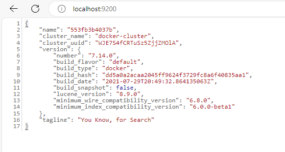
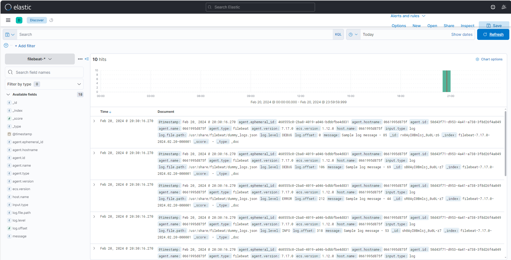
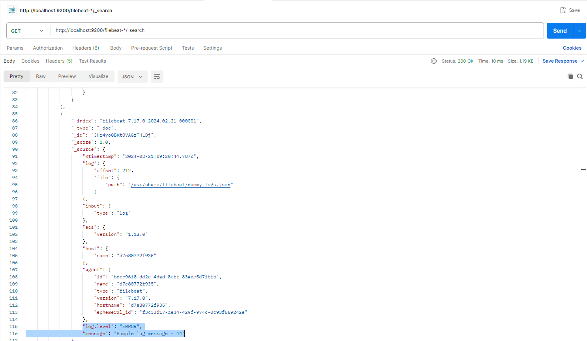
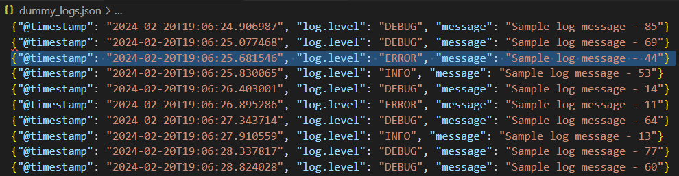

## Elastic Search

```
docker run -e "discovery.type=single-node" docker.elastic.co/elasticsearch/elasticsearch:7.14.0
```
Pulleamos elastic search, con la versión deseada. 
- He utilizado esta porque vi la [recomendación](https://www.youtube.com/watch?v=TpiHgWqW4Yw) e informaba que era un FOSS.

```
docker stop id
```

```
docker rm id
```


Paro el docker y lo elimino. Ahora, voy a **crear** un nuevo docker con los puertos del host y docker configurados.

```
docker run -d -p 9200:9200 --name elasticsearch_container -e "discovery.type=single-node" docker.elastic.co/elasticsearch/elasticsearch:7.14.0
```

- d : ejecuta el contenedor en 2º plano, modo daemon. El terminal no queda bloqueado por la ejecución del contenedor. 
-  9200:9200
- Host port:docker port.

Ahora que tenemos runneado el docker en el puerto 9200 de nuestro ordenador, si accedemos a **[http://localhost:9200/](http://localhost:9200/)** nos aparecería la **respuesta de elasticsearch** 



También, si queremos comprobar de otra manera la respuesta, al tener bloqueada la terminal 
podemos hacer uso del siguiente comando para obtener la respuesta del puerto 9200.

```
$ curl -XGET http://localhost:9200/
```

Respuesta: 
```
{
  "name" : "9bd15b8ae428",
  "cluster_name" : "docker-cluster",
  "cluster_uuid" : "Gq4dxG5lSrOOUnzSX8l77Q",
  "version" : {
    "number" : "7.14.0",
    "build_flavor" : "default",
    "build_type" : "docker",
    "build_hash" : "dd5a0a2acaa2045ff9624f3729fc8a6f40835aa1",
    "build_date" : "2021-07-29T20:49:32.864135063Z",
    "build_snapshot" : false,
    "lucene_version" : "8.9.0",
    "minimum_wire_compatibility_version" : "6.8.0",
    "minimum_index_compatibility_version" : "6.0.0-beta1"
  },
  "tagline" : "You Know, for Search"
}
```


2º pull de Filebeat

```
docker pull filebeat:7.14.0
```

```
docker run filebeat:7.14.0 -p 9200:9200
```


## Docker-compose sin Kibana

Ahora que he trasteado con docker voy a crear el archivo encargado de generar los logs.

## Creación de JSON 

1º creo el archivo para los dummy_logs.py
```
import json
from datetime import datetime
import random

# Función para generar registros dummy
def generate_dummy_log():
    timestamp = datetime.utcnow().isoformat()
    log_level = random.choice(['INFO', 'ERROR', 'DEBUG'])
    message = f"Sample log message - {random.randint(1, 100)}"
    
    log_entry = {
        "@timestamp": timestamp,
        "log.level": log_level,
        "message": message
    }
    
    return log_entry

# Número de registros dummy a generar
num_logs = 10

# Ruta del archivo JSON de salida
output_file_path = "./logs/dummy_logs.json"
# Crear y guardar los registros en un archivo JSON, cada uno en una línea nueva
with open(output_file_path, 'w') as output_file:
    for _ in range(num_logs):
        log_entry = generate_dummy_log()
        json.dump(log_entry, output_file)
        output_file.write('\n')

print(f"Archivo JSON con {num_logs} registros dummy creado en {output_file_path}\n")

```
Ahora, ejecutandolo el archivo me va a crear un archivo .json en el directorio ./logs/dummy_logs.json

A continuación, voy a crear el docker-compose. 

```
version: '3'
services:
  elasticsearch:
    image: docker.elastic.co/elasticsearch/elasticsearch:7.17.0
    ports:
      - "9200:9200" # Host port:docker port.
    environment:
      - discovery.type=single-node  # Runnea el docker como un single-node

  filebeat:
    image: docker.elastic.co/beats/filebeat:7.17.0
    ports: 
      - "5601:5601" 
    command: filebeat -e -strict.perms=false # ejecutar sin problemas de admnistrados

    # monto filebeat y los logs 
    volumes:
      - ./filebeat.yml:/usr/share/filebeat/filebeat.yml:rw
      - ./logs/dummy_logs.json:/usr/share/filebeat/dummy_logs.json:rw
      - /var/lib/docker/containers # recolección de logs
```

Ya que no soy capaz de comprobar si estoy mandando correctamente los datos voy a hacer uso de Kibana ya que ofrece una interfaz y así voy a visualizar si los datos de los logs me llegan correctamente.

## Docker-compose con Kibana

```
version: '3'
services:
  elasticsearch:
    image: docker.elastic.co/elasticsearch/elasticsearch:7.17.0
    ports:
      - "9200:9200" # Host port:docker port.
    environment:
      - discovery.type=single-node  # Runnea el docker como un single-node

  kibana:
    image: docker.elastic.co/kibana/kibana:7.17.0
    ports:
      - "5601:5601"  
    depends_on: 
      - elasticsearch # se inicia después de elastic-search

  filebeat:
    image: docker.elastic.co/beats/filebeat:7.17.0
    #ports: 
    #  - "5601:5601"
    command: filebeat -e -strict.perms=false # ejecutar sin problemas de admnistrados

    # monto filebeat y los logs 
    volumes:
      - ./filebeat.yml:/usr/share/filebeat/filebeat.yml:rw
      - ./logs/dummy_logs.json:/usr/share/filebeat/dummy_logs.json:rw
      - /var/lib/docker/containers # recolección de logs
```
```

filebeat.inputs:
- type: log
  enabled: true
  paths:
    - /usr/share/filebeat/*json # path del contenedor! no la del
    
  json.keys_under_root: true
  json.add_error_key: true

output.elasticsearch:
  hosts: ["elasticsearch:9200"] 
  index: "filebeat-%{+yyyy-MM-dd}"

setup.template.name: "filebeat"
setup.template.pattern: "filebeat-*"
```
- Para comprobar los datos tengo que crear un Índice dentro de la Interfaz, http://localhost:5601/, para ello  http://localhost:5601/app/management/kibana/indexPatterns > click en **Create Index Pattern** > le llamas igual que el nombre de setup.template.pattern: nombre.
- Si lo has realizado correctamente, en Analytics> Discover > refresh te debería de mostrar la siguiente pantalla:





## POSTMAN

- Para comprobar que los datos se están mandando y con el formato correcto, en Postman haces la siguiente llamada:

```
http://localhost:9200/tuíndice-*/_search
```
De esta manera compruebas si los datos son mandados como aparece en el filebeat.yml:
```
.... código
index: "filebeat-%{+yyyy-MM-dd}"
```

| | | |
|--- | --- | --- |
| Postman | JSON| 
|    |     | 
|        |             | 
|         |             | 
Si no se aprecian las imágenes: Este es la parte del JSON en Postman:
```
       "_index": "filebeat-7.17.0-2024.02.21-000001",
                "_type": "_doc",
                "_id": "JHr4yo0BKtOVAGzTHLDj",
                "_score": 1.0,
                "_source": {
                    "@timestamp": "2024-02-21T09:20:44.787Z",
                    "log": {
                        "offset": 212,
                        "file": {
                            "path": "/usr/share/filebeat/dummy_logs.json"
                        }
                    },
                    "input": {
                        "type": "log"
                    },
                    "ecs": {
                        "version": "1.12.0"
                    },
                    "host": {
                        "name": "d7e80772f935"
                    },
                    "agent": {
                        "id": "bdcc96f8-dd2e-4dad-8ebf-83ade5d7fbfb",
                        "name": "d7e80772f935",
                        "type": "filebeat",
                        "version": "7.17.0",
                        "hostname": "d7e80772f935",
                        "ephemeral_id": "f3c33d17-ae34-429f-974c-0c93f669242e"
                    },
                    "log.level": "ERROR",
                    "message": "Sample log message - 44"
                }
```

Y este el objeto JSON:
```
{"@timestamp": "2024-02-20T19:06:25.681546", "log.level": "ERROR", "message": "Sample log message - 44"}
```


# PROBLEMAS
- A la hora de crear los contenedor de manera individual no podía abrir otro terminal y hacer la llamada para comprobarlo. Era porque no lo estaba ejecutando en 2º plano.

- Version antigua por lo que con la información que estaba empleando no me aparecía la version de **create Index pattern**

- Attaching to d_iot_filebeat_1, d_iot_elasticsearch_1, d_iot_kibana_1
filebeat_1       | Exiting: error loading config file: config file ("filebeat.yml") can only be writable 
by the owner but the permissions are "-rwxrwxrwx" (to fix the permissions use: 'chmod go-w /usr/share/filebeat/filebeat.yml')
d_iot_filebeat_1 exited with code 1

- Los datos que recoge Kibana son los enviados en el docker anterior.

# MEJORAS
- Crear un contenedor de python que ejecute el script, pero no he tenido tiempo.
